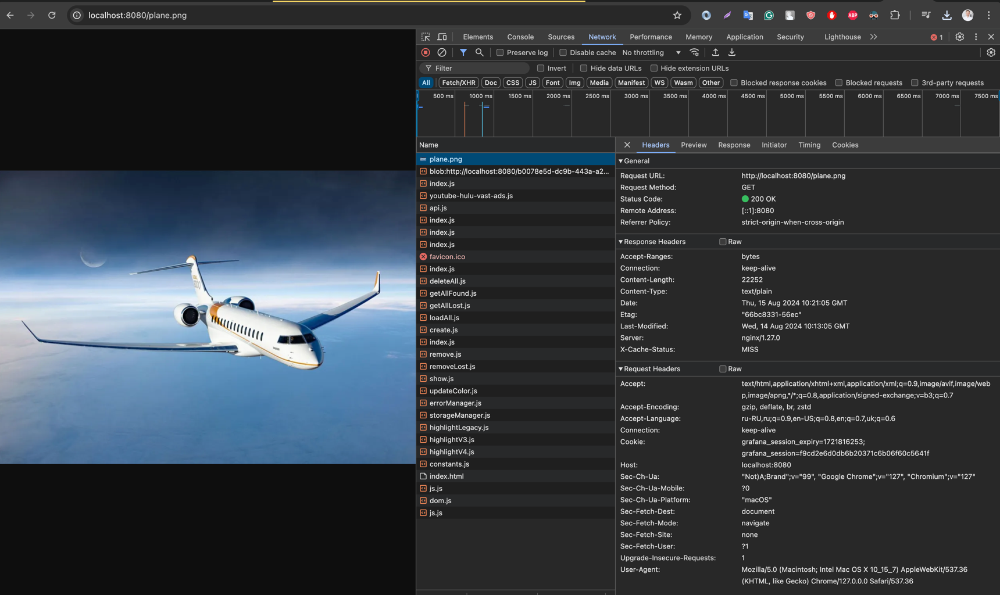
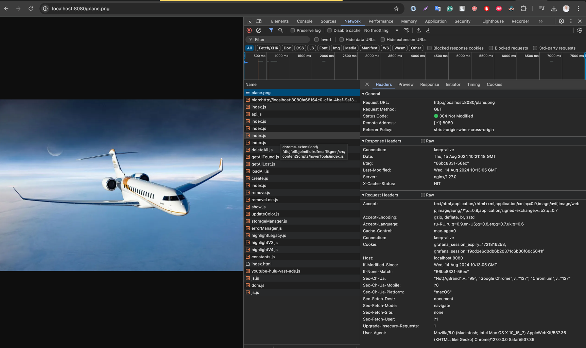
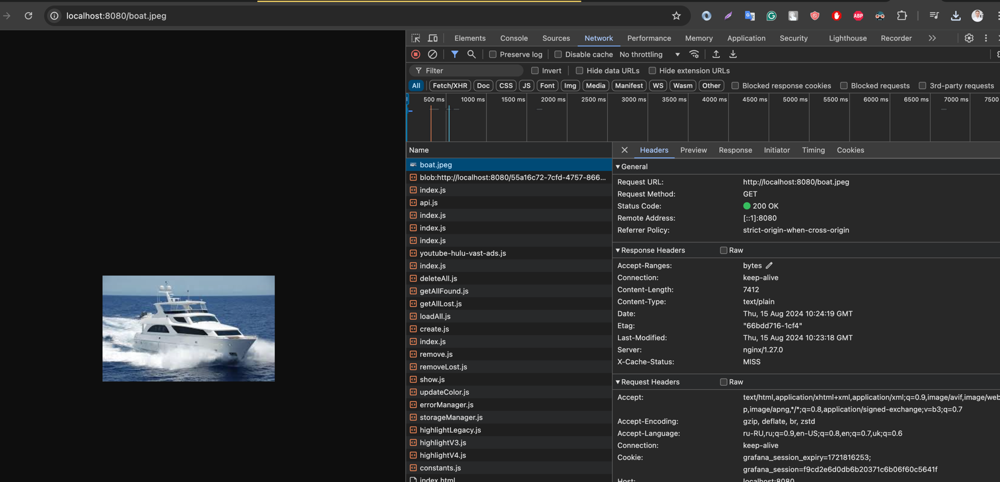
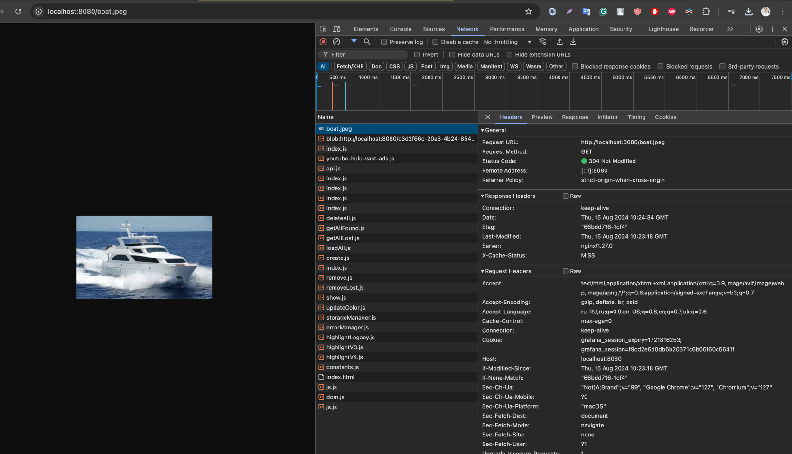
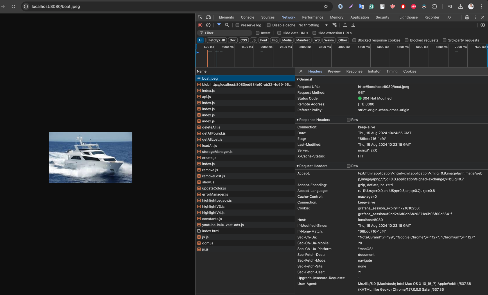
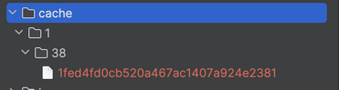

# Nginx Fine Tuning

## Configure nginx that will cache only images, that were requested at least twice

1. Run `docker-compose up` to start nginx-cache and nginx-origin
2. Open `http://localhost:8080/plane.png` in your browser to request the image first time

- x-cache-status: `MISS`



3. Open again `http://localhost:8080/plane.png` in your browser to request the image second time

- x-cache-status: `MISS`


4. Open again `http://localhost:8080/plane.png` in your browser to request the image third time

- x-cache-status: `HIT`



5. Open `http://localhost:8080/boat.jpeg` in your browser to request the image first time

- x-cache-status: `MISS`




6. Open again `http://localhost:8080/boat.jpeg` in your browser to request the image second time

- x-cache-status: `MISS`



7. Open again `http://localhost:8080/boat.jpeg` in your browser to request the image third time

- x-cache-status: `HIT`



## Add ability to drop nginx cache by request. You should drop cache for specific file only ( not all cache )

```lua
location /purge {
    content_by_lua_block {
        local uri = ngx.var.arg_file
        if not uri then
            ngx.say("Missing file parameter")
            return
        end

        local cache_key = ngx.md5(ngx.var.scheme .. ngx.var.host .. uri)
        local cache_file = "/var/cache/nginx/" .. string.sub(cache_key, -1) .. "/" .. string.sub(cache_key, -3, -2) .. "/" .. cache_key

        ngx.say("Purging cache for: ", uri)
        ngx.say("Cache key: ", cache_key)
        ngx.say("Cache file: ", cache_file)

        local result = os.execute("rm -f " .. cache_file)
        if result == 0 then
            ngx.say("Cache purged successfully")
        else
            ngx.say("Failed to purge cache")
        end
    }
}
```

- After running purge request for `/plane.png` file, I can't find the file in the cache directory
- ChatGPT cannot help 😁

```bash
curl "http://localhost:8080/purge?file=/plane.png"

Purging cache for: /plane.png
Cache key: 4aa49235f8a717f647107871ce1a68d1
Cache file: /var/cache/nginx/1/8d/4aa49235f8a717f647107871ce1a68d1
Failed to purge cache
```

- Even though the cache file for plane.png us here, the cache is not purged

